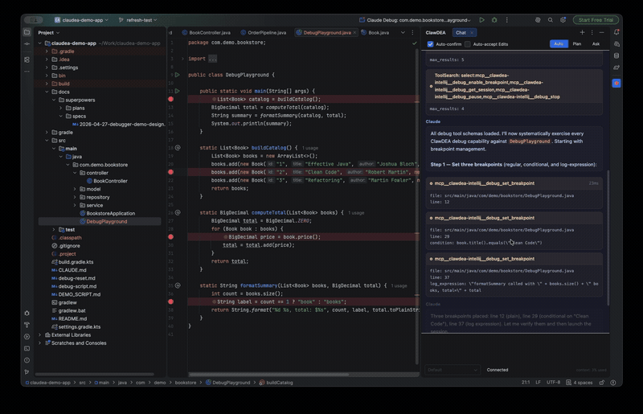

# ClawDEA

> **[Download latest release](https://github.com/adobe/ClawDEA/releases/latest)** · **[User Guide](docs/user-guide.md)**

Native [Claude Code](https://docs.anthropic.com/en/docs/claude-code) integration for IntelliJ IDEA. ClawDEA's standout capability is a **self-maintaining project wiki** — a knowledge layer that stays in sync with your code, ships an orientation primer with every turn, and is ready to share across a team via git. On top of that it adds **JVM profiling as a diagnostic loop** (Claude reads JFR/heap analysis and proposes source-level fixes), plus IDE-grade code navigation, edit review, and debugging — all without leaving the IDE.

ClawDEA also coexists with IntelliJ's own [bundled MCP server](https://www.jetbrains.com/help/idea/mcp-server.html): when you enable it, ClawDEA steps aside for the handful of overlapping tools and keeps serving the ones with no IDE-native equivalent (see [Features](#features)).

**New in 2.0:** the chat panel can drive **OpenAI Codex** as well as Claude Code. Pick your provider (ChatGPT subscription / OpenAI API key, or Claude), and Codex runs through the same MCP toolset — index, debugger, edit review, primer, and skills. Inline completions and intention actions remain Claude-only for now.

**OpenAI-compatible provider profiles:** Organizations can distribute custom provider profiles (templates or pre-configured) that define model catalogs, credential flows, and pricing for OpenAI-compatible APIs. Import a profile via Settings, preview and confirm before it's activated, then select a model and use completions and intention actions through that provider. Secrets persist in the IDE's PasswordSafe; exports never contain credentials. See the [User Guide](docs/user-guide.md#openai-compatible-provider-profiles) for the full workflow.

**New in 2.2 — agentic chat over any OpenAI-compatible provider:** when a profile's model is verified as tool-capable, the chat panel drives it as a full agent over the OpenAI-compatible Chat Completions API — streamed text and reasoning, ClawDEA's MCP tools plus permission-gated shell and reviewed edits, cancel-and-continue steering, profile-native session resume, and per-token cost estimates from the profile's configured pricing. Completion-only or unverified models cannot start agentic chat, and switching a conversation between providers is always explicit — never silent. See [OpenAI-compatible provider](docs/llm-wiki/concepts/openai-compatible-provider.md).

**New in 3.0 — per-role providers, a tabbed Settings UI, and a cross-provider wiki-librarian:** Settings is now organized into **Providers / Roles / Permissions / Knowledge Layer / Profiling / Advanced** tabs. The new **Roles** tab lets Chat, Wiki, and Completions each run on an independently-selected provider and model — e.g. chat on Claude, wiki upkeep on a cheap OpenAI-compatible model, completions on a third. `ask_wiki_librarian` now honors whichever provider the **Wiki** role points at: a headless `claude -p` subprocess for Claude-family, `codex exec --json` (read-only sandbox, no MCP) for Codex, or an in-process agentic tool loop for an OpenAI-compatible profile — replacing the old Claude-only `--agents` subagent. The OpenAI-compatible agent loop also gains a **Skill tool** (invoke Claude Code skills) and an **Agent tool** (dispatch sub-agents), plus configurable context-window compaction for long-running turns. The self-maintaining wiki adds **orphan-subsystem detection** — flags whole new subsystems (e.g. a batch of same-prefix classes) that no wiki page mentions at all, closing a gap the existing stale-link/rename detectors couldn't see.

<p align="center">
  
  <br>
  <em>Claude autonomously debugging a Java application — breakpoints, stepping, variable inspection, and runtime mutation</em>
</p>

### Install from release

1. Download `ClawDEA-<version>.zip` from the link above.
2. In IntelliJ: **Settings → Plugins → ⚙ → Install Plugin from Disk…**
3. Select the zip and restart.

## Features

**Knowledge layer (self-maintaining wiki)** — A project-local wiki under `.clawdea/wiki/` (auto-generated `REPO_STATE.md`, concept pages, primer) that **keeps itself in sync with the code**: a commit-driven drift detector notices when a page's claims go stale, an orphan-subsystem detector flags whole new areas with no page at all, and a bundled `wiki-author` agent drafts the fix — with **Auto-update wiki on drift** enabled it lands edits unattended in the background. The primer ships with every turn so Claude starts each conversation already oriented — no "let me explore the codebase first". The `ask_wiki_librarian` tool answers project-design questions in its own fresh context, citing concept pages and verifying claims against current source; it runs on whichever provider the **Roles** tab's Wiki role points at — Claude, Codex, or an OpenAI-compatible profile. **Team-ready:** run `/wiki-relocate docs/llm-wiki` to commit the wiki path to `.clawdea/config.json`; teammates auto-discover the shared wiki on clone, with per-user vs team-shared drift state split automatically. `/seed-workspace` assembles a multi-repo manifest for cross-repo navigation via `read_sibling_wiki` / `read_sibling_repo_state`. See the [User Guide](docs/user-guide.md#wiki-team-mode) for details.
Check out ClawDEA's own self-maintained wiki at https://github.com/adobe/ClawDEA/blob/main/docs/llm-wiki/index.md

**Profiling** — Claude can profile your code via JDK Flight Recorder: launch tests or run configurations with JFR instrumentation, then analyze CPU hotspots, allocation pressure, and memory leaks. Three entry points: `/profile` slash command, gutter icon on `@Test` methods, or imported `.jfr`/`.hprof` files. Claude reads the analysis results and proposes source-level fixes — a closed diagnostic loop from "this is slow" to a concrete patch.

**Chat panel** — Streams responses with Markdown, code blocks, tool-use cards, and clickable code references that navigate to source. Reasoning is streamed live in a collapsible **Thinking** block that closes when the turn ends. Open from **Tools → Toggle ClawDEA Chat** (assign your own shortcut in Keymap settings). **Backend choice:** chat with **Claude Code**, **OpenAI Codex**, or a verified-agentic **OpenAI-compatible provider profile** — switch from the model dropdown and ClawDEA routes to the right backend automatically, keeping the full MCP toolset (index, debugger, diff-gated edit review, primer, skills, and — for OpenAI-compatible — a Skill tool and an Agent tool for sub-agent dispatch) across all three. Sessions from all backends appear in `/resume` (labeled by origin); resuming across backends replays the prior conversation as context.

**Code navigation & MCP server** — A local server exposes IntelliJ's indices as MCP tools: find files, usages, callers, implementations, supertypes, resolve symbols, read diagnostics, literal/regex content search, and cross-project navigation via `list_workspace_repos` / `read_sibling_wiki` / `read_sibling_repo_state` when a workspace manifest is present.

> **Coexists with IntelliJ's bundled [MCP server](https://www.jetbrains.com/help/idea/mcp-server.html).** When you enable IntelliJ's own MCP server, ClawDEA automatically stops serving the four tools the IDE already covers (`search_text`, `find_files`, `resolve_symbol`, `get_diagnostics`) so Claude isn't carrying duplicate-capability tools. ClawDEA keeps serving the tools the IDE's MCP server has **no equivalent** for, which is most of them: the usage/caller/type-hierarchy graph (`find_usages`, `find_callers`, `find_implementations`, `find_supertypes`, `find_related_types`), ownership-tracked debugging (your breakpoints are never deleted), diff-gated edit review (proposed edits open a review dialog instead of being applied silently), JFR profiling, the knowledge layer and wiki tools, and cross-repo workspace navigation. Detection is fail-open — if it can't read the IDE setting, it keeps all tools registered.

**Debugger integration** — 21 MCP tools let Claude drive IntelliJ's debugger: launch sessions, set breakpoints (with conditions and log expressions), step through code, inspect variables, evaluate expressions, and modify values at runtime. Breakpoint ownership tracking ensures your breakpoints are never deleted.

**Edit review** — When "Auto-accept Edits" is off, each proposed change opens a native IntelliJ diff dialog with Accept/Reject. Built-in Edit/Write calls that slip through are caught by a fallback layer with inline buttons and file revert.

**Tool permissions** — Three approval modes (Confirm all / Allow safe / Allow all). When either CLI requests permission for a tool call — including Codex's own shell commands and patches — ClawDEA honors Claude Code `permissions.allow` / `permissions.deny` rules first; otherwise an inline permission card appears in the chat tab that triggered the tool call (multi-panel routing) with Allow / Always allow / Deny buttons. The CLI blocks until you decide.

**@ mentions** — Type `@` for inline autocomplete (open editor tabs + recently git-modified files); press `@` then Tab to open a full picker with grouped Files and Symbols sections, backed by IntelliJ's filename and short-name caches.

**Inline completions** — Tab-completions powered by the Claude API or an OpenAI-compatible provider (when a profile is active and a model is selected). Uses editor context gathered by the context engine.

**Intention actions** (Alt+Enter) — Explain, Optimize, Generate Test, Security Check, Add Documentation, Refactor, Ask Claude, Fix with Claude. Works with Claude or a selected OpenAI-compatible provider.

**Slash commands** — `/stop`, `/clear`, `/mode`, `/cost`, `/compact`, `/context`, `/resume`, `/skills`, `/login`, `/cc`, `/init`, `/profile`, `/callers`, `/usages`, `/implementations`, `/supertypes`, `/refresh-view`, knowledge-layer commands (`/note`, `/promote-to-wiki`, `/learn`, `/seed-wiki`, `/refresh-wiki`, `/wiki-audit`, `/wiki-gap`, `/wiki-relocate`, `/seed-workspace`), plus Claude Code skills discovered at runtime.

**Session resume** — Pick up a previous session (Claude, Codex, or an OpenAI-compatible profile, labeled by origin) with conversation history replayed in the chat panel. Resuming the same backend is native; resuming across backends replays the prior conversation as context so you can continue seamlessly.

**Mid-turn steering (Codex)** — Send a message while Codex is still working and it's injected into the running turn via native `turn/steer` — the model folds in your guidance without restarting. (Claude has no steer primitive, so a message sent mid-turn queues for the next turn as before.)

## Requirements

- IntelliJ IDEA 2026.1+
- Java 21
- [Claude Code CLI](https://docs.anthropic.com/en/docs/claude-code) installed (`npm install -g @anthropic-ai/claude-code`)
- To chat with OpenAI Codex: the [OpenAI Codex CLI](https://developers.openai.com/codex/) installed (`npm install -g @openai/codex`)
- To chat with an OpenAI-compatible provider (no CLI needed): an imported provider profile with a verified agentic model — see [OpenAI-compatible provider profiles](docs/user-guide.md#openai-compatible-provider-profiles)
- Auth for at least one backend: Claude (Anthropic API key, subscription, AWS Bedrock, or Google Vertex), OpenAI (ChatGPT subscription or OpenAI API key), and/or an OpenAI-compatible profile's own credentials

## Quick Start

1. Install a CLI: `npm install -g @anthropic-ai/claude-code` (Claude) and/or `npm install -g @openai/codex` (OpenAI Codex).
2. Install the plugin from a release zip (or build from source — see below).
3. Open **Settings → Tools → ClawDEA** (tabbed: Providers / Roles / Permissions / Knowledge Layer / Profiling / Advanced) and pick a provider on the **Providers** tab: configure an API key or sign in with a Claude subscription, or choose **OpenAI (ChatGPT subscription)** / **OpenAI API**. Optionally use the **Roles** tab to point Chat, Wiki, and Completions at different providers/models.
4. Open the chat panel (**Tools → Toggle ClawDEA Chat**) and start coding.

See the **[User Guide](docs/user-guide.md)** for detailed configuration, slash commands, debugger workflows, and troubleshooting.

## Development

```
./gradlew runIde                           # Launch sandboxed IDE with the plugin
./gradlew test                             # Unit tests
./gradlew build -x buildSearchableOptions  # Full build (skip searchable options if IDE is running)
```

## Project Structure

```
src/main/kotlin/com/adobe/clawdea/
  actions/       Intention actions, context menu, keyboard shortcuts
  chat/          ChatPanel, MessageRenderer, EditDiffReviewer, EditReviewCoordinator
  cli/           CliBridge, CliProcess/CliEventParser (Claude), CodexAppServerProcess/CodexAppServerParser (Codex); cli/backend/ has the AgentBackend abstraction, incl. OpenAiCompatibleAgentBackend
  commands/      Slash command registry and handlers
  completions/   Inline completion provider
  context/       Context engine for gathering editor state
  cost/          Per-turn cost tracking, savings estimation, model pricing
  debug/         DebugBridge, McpDebugTools, BreakpointTracker, SuspendGate
  gateway/       Claude API gateway for completions
  knowledge/     Drift detection (incl. orphan-subsystem detection), wiki maintenance, wiki-author auto-apply
  mcp/           MCP HTTP server, tool router, index/IDE/context/edit-review/wiki tools
  profiling/     JFR backend, CPU/allocation/leak analysis, MCP profiling tools
  provider/      AgentSelection/AgentRole, ProviderRegistry, per-role selection; provider/openai/ has the OpenAI-compatible provider's agent loop (agent/), auth/credential exchange (auth/), model catalog (catalog/), HTTP client (client/), profile store (profile/), session ledger (session/), and tool catalog (tools/)
  settings/      Plugin settings; settings/tabs/ has the Providers/Roles/Permissions/Knowledge Layer/Profiling/Advanced tabs
  skills/        Skill scanner and picker dialog

scripts/drift/   Claude Code drift monitoring (watchlist, snapshot collector, issue filer)
.github/workflows/claude-code-drift.yml   Weekly drift digest workflow
src/test/resources/cli-fixtures/   Recorded NDJSON fixture replayed by CliFixtureReplayTest
```

## Staying in sync with Claude Code

ClawDEA wraps the Claude Code CLI as a subprocess. To catch upstream changes (new flags, renamed stream-json fields, MCP config schema additions) without manual scanning, the repo runs a two-part monitoring system:

- A **weekly drift digest** (`.github/workflows/claude-code-drift.yml`) diffs `claude --help`, sub-command help, npm version, and selected docs URLs against a moving git tag (`drift-snapshot`); files an issue when a watchlisted regex matches a changed line.
- A **PR-time fixture replay test** (`CliFixtureReplayTest`) replays a recorded NDJSON transcript through `CliEventParser`; goes red if a new event type appears upstream.

See [`docs/drift-monitoring.md`](docs/drift-monitoring.md) for the full operator guide — adding watchlist entries, triaging auto-filed issues, refreshing the fixture, reseeding the snapshot tag.

## Contributing

Contributions are welcome! Read [CONTRIBUTING](.github/CONTRIBUTING.md) for
details on the contribution process and the [Code of Conduct](CODE_OF_CONDUCT.md)
that all contributors are expected to follow.

All contributors must sign the [Adobe Contributor License Agreement](https://opensource.adobe.com/cla.html)
before their pull requests can be merged.

## Security

See [SECURITY.md](SECURITY.md) for our vulnerability disclosure process.
Please do not report security issues through GitHub issues.

## License

ClawDEA is licensed under the Apache License, Version 2.0. See [LICENSE](LICENSE)
for the full text and [NOTICE](NOTICE) for required attributions.

"Claude" and "Claude Code" are trademarks of Anthropic, PBC. "IntelliJ",
"IntelliJ IDEA", and "JetBrains" are trademarks of JetBrains s.r.o. References
to these names in this project are factual identifiers of third-party products
this plugin integrates with, and are not claims of affiliation with or
endorsement by their respective owners.
